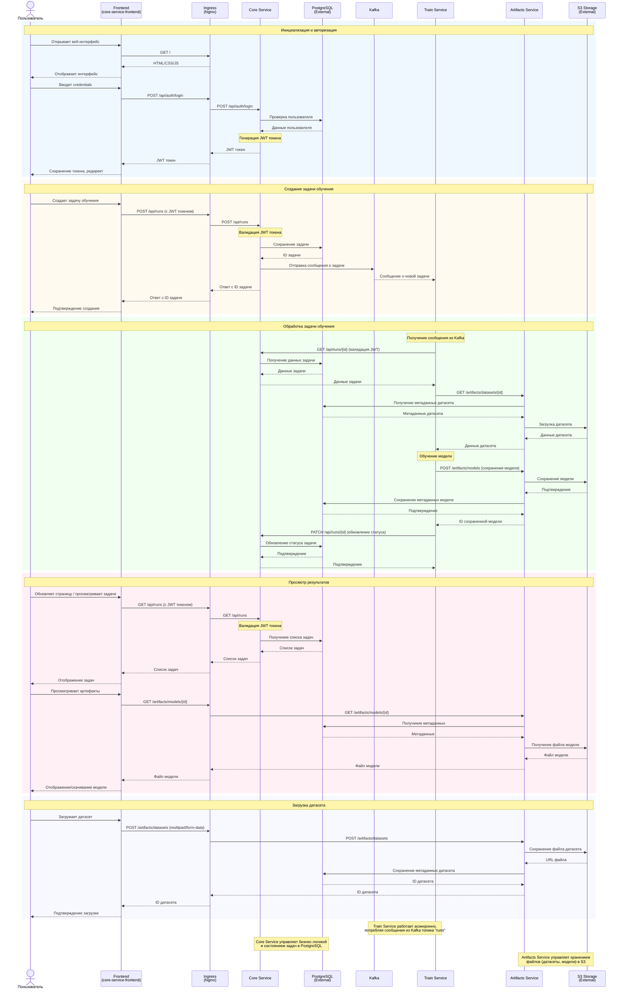

# Диаграмма взаимодействия пользователя с системой

```mermaid
sequenceDiagram
    actor Пользователь
    participant Frontend as Frontend<br/>(core-service-frontend)
    participant Ingress as Ingress<br/>(Nginx)
    participant CoreService as Core Service
    participant PostgreSQL as PostgreSQL<br/>(External)
    participant Kafka as Kafka
    participant TrainService as Train Service
    participant ArtifactsService as Artifacts Service
    participant S3 as S3 Storage<br/>(External)

    rect rgb(240, 248, 255)
        Note over Пользователь, S3: Инициализация и авторизация
        
        Пользователь->>Frontend: Открывает веб-интерфейс
        Frontend->>Ingress: GET /
        Ingress-->>Frontend: HTML/CSS/JS
        Frontend-->>Пользователь: Отображает интерфейс
        
        Пользователь->>Frontend: Вводит credentials
        Frontend->>Ingress: POST /api/auth/login
        Ingress->>CoreService: POST /api/auth/login
        CoreService->>PostgreSQL: Проверка пользователя
        PostgreSQL-->>CoreService: Данные пользователя
        Note over CoreService: Генерация JWT токена
        CoreService-->>Ingress: JWT токен
        Ingress-->>Frontend: JWT токен
        Frontend-->>Пользователь: Сохранение токена, редирект
    end

    rect rgb(255, 250, 240)
        Note over Пользователь, S3: Создание задачи обучения
        
        Пользователь->>Frontend: Создает задачу обучения
        Frontend->>Ingress: POST /api/runs (с JWT токеном)
        Ingress->>CoreService: POST /api/runs
        Note over CoreService: Валидация JWT токена
        CoreService->>PostgreSQL: Сохранение задачи
        PostgreSQL-->>CoreService: ID задачи
        CoreService->>Kafka: Отправка сообщения о задаче
        Kafka-->>TrainService: Сообщение о новой задаче
        CoreService-->>Ingress: Ответ с ID задачи
        Ingress-->>Frontend: Ответ с ID задачи
        Frontend-->>Пользователь: Подтверждение создания
    end

    rect rgb(240, 255, 240)
        Note over Пользователь, S3: Обработка задачи обучения
        
        Note over TrainService: Получение сообщения из Kafka
        TrainService->>CoreService: GET /api/runs/{id} (валидация JWT)
        CoreService->>PostgreSQL: Получение данных задачи
        PostgreSQL-->>CoreService: Данные задачи
        CoreService-->>TrainService: Данные задачи
        TrainService->>ArtifactsService: GET /artifacts/datasets/{id}
        ArtifactsService->>PostgreSQL: Получение метаданных датасета
        PostgreSQL-->>ArtifactsService: Метаданные датасета
        ArtifactsService->>S3: Загрузка датасета
        S3-->>ArtifactsService: Данные датасета
        ArtifactsService-->>TrainService: Данные датасета
        Note over TrainService: Обучение модели
        TrainService->>ArtifactsService: POST /artifacts/models (сохранение модели)
        ArtifactsService->>S3: Сохранение модели
        S3-->>ArtifactsService: Подтверждение
        ArtifactsService->>PostgreSQL: Сохранение метаданных модели
        PostgreSQL-->>ArtifactsService: Подтверждение
        ArtifactsService-->>TrainService: ID сохраненной модели
        TrainService->>CoreService: PATCH /api/runs/{id} (обновление статуса)
        CoreService->>PostgreSQL: Обновление статуса задачи
        PostgreSQL-->>CoreService: Подтверждение
        CoreService-->>TrainService: Подтверждение
    end

    rect rgb(255, 240, 245)
        Note over Пользователь, S3: Просмотр результатов
        
        Пользователь->>Frontend: Обновляет страницу / просматривает задачи
        Frontend->>Ingress: GET /api/runs (с JWT токеном)
        Ingress->>CoreService: GET /api/runs
        Note over CoreService: Валидация JWT токена
        CoreService->>PostgreSQL: Получение списка задач
        PostgreSQL-->>CoreService: Список задач
        CoreService-->>Ingress: Список задач
        Ingress-->>Frontend: Список задач
        Frontend-->>Пользователь: Отображение задач
        
        Пользователь->>Frontend: Просматривает артефакты
        Frontend->>Ingress: GET /artifacts/models/{id}
        Ingress->>ArtifactsService: GET /artifacts/models/{id}
        ArtifactsService->>PostgreSQL: Получение метаданных
        PostgreSQL-->>ArtifactsService: Метаданные
        ArtifactsService->>S3: Получение файла модели
        S3-->>ArtifactsService: Файл модели
        ArtifactsService-->>Ingress: Файл модели
        Ingress-->>Frontend: Файл модели
        Frontend-->>Пользователь: Отображение/скачивание модели
    end

    rect rgb(248, 248, 255)
        Note over Пользователь, S3: Загрузка датасета
        
        Пользователь->>Frontend: Загружает датасет
        Frontend->>Ingress: POST /artifacts/datasets (multipart/form-data)
        Ingress->>ArtifactsService: POST /artifacts/datasets
        ArtifactsService->>S3: Сохранение файла датасета
        S3-->>ArtifactsService: URL файла
        ArtifactsService->>PostgreSQL: Сохранение метаданных датасета
        PostgreSQL-->>ArtifactsService: ID датасета
        ArtifactsService-->>Ingress: ID датасета
        Ingress-->>Frontend: ID датасета
        Frontend-->>Пользователь: Подтверждение загрузки
    end

    Note over TrainService, Kafka: Train Service работает асинхронно,<br/>потребляя сообщения из Kafka топика "runs"
    Note over CoreService, PostgreSQL: Core Service управляет бизнес-логикой<br/>и состоянием задач в PostgreSQL
    Note over ArtifactsService, S3: Artifacts Service управляет хранением<br/>файлов (датасеты, модели) в S3
```

